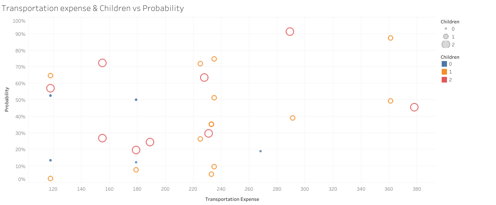
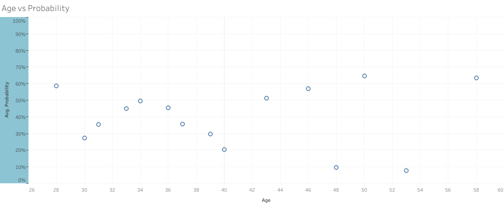
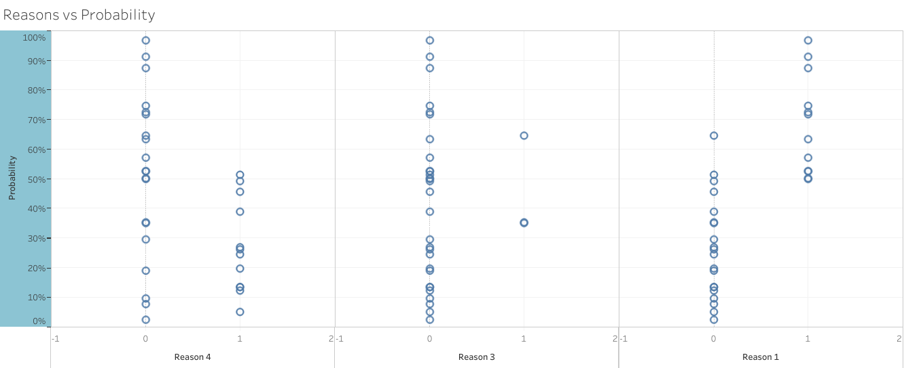

# Absenteeism Analysis Project

## Overview

This repository contains the code and documentation for my first data science project, focusing on the analysis of absenteeism in the workplace. The goal of the project is to gain insights into absenteeism patterns, identify potential factors influencing absenteeism, and provide valuable information for decision-making.

## Project Highlights

- **Data Cleaning**: Exploring and handling missing values, outliers, and data inconsistencies.
- **Exploratory Data Analysis (EDA)**: Analyzing absenteeism patterns, trends, and correlations.
- **Feature Engineering**: Creating relevant features for modeling.
- **Modeling**: Developing logistic regression model with scikit-learn to forecast future absenteeism.
- **Visualizations**: Communicating insights through visualizations using Tabelau Public for better understanding.

# Here's a visualization from my project:

